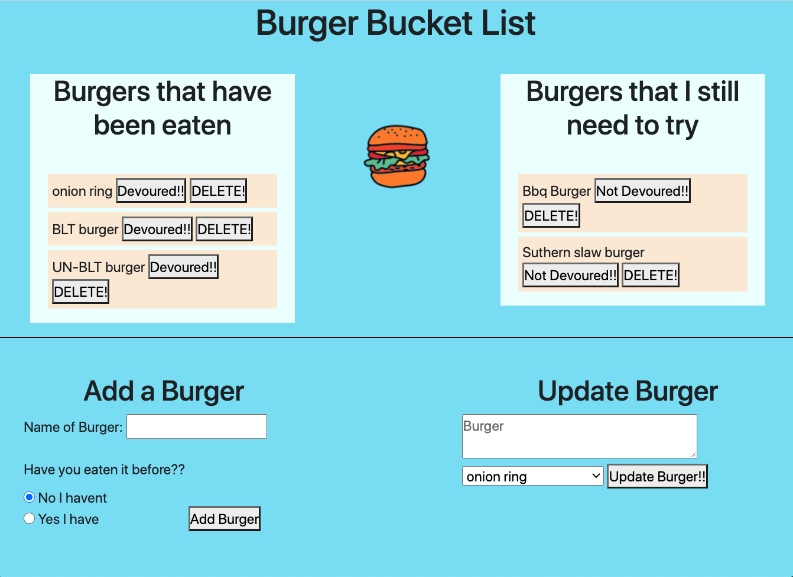
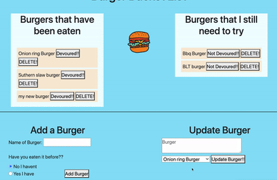

# Burger Eater

## license


## Description

This is an application that allows for real burger eater's to keep track of their burger bucketlist.
- The app is based around a mySQL database and use of Hanldebars. 
- This a client side application.

## Main Window

  


## Table of contents

- [Description](#Description)
- [Installation](#Installation)
- [Usage](#Usage)
- [Licence](#License)
- [Contributors](#Contributors)
- [Test](#Test)
- [Repository Link](#Repository)
- [GitHub Info](#GitHub)

  ## Installation

  - Clone the reposatory into a local file in you're computer.
  - Run "npm i" inside of the terminal.
  - Run "node server" for the application to work.

  ## Usage

- This application uses MySQL workbench as the database to store the information about the burgers that we have in our list.
- It uses handlebars to render the information sent back from the database and to post information into our database.
- You can edit the name of an existing burger inside of your list, as well as changing it from the column of burgers that you have already "eaten" and back to the other column if you wish.
 ## Directory 

 ```
├── config
│   ├── connection.js
│   └── orm.js
│ 
├── controllers
│   └── burgersController.js
│
├── db
│   ├── schema.sql
│   └── seeds.sql
│
├── models
│   └── burger.js
│ 
├── node_modules
│ 
│── public
│   └── assets
│       ├── css
│       │   └── style.css
│       ├──js
│       │   └── burger.js
│       └── img
│           └── appImage.png
│
├──views
│    ├── index.handlebars
│    ├── layouts
│    │    └── main.handlebars
│    └── partials
│         └── burger-block.handlebars
│
├── .gitignore
│
├── package-lock.json
│
├── package.json   
│
├── server.js
│
└──README.md

```

  ## Constributors

  Miguelangel Weill

  ## Test

  

  ## Git hub user name

  miguelangelWeill

  ## Repository


[Git hub profile](https://api.github.com/users/Miguelangelweill)

[This is my Git Hub repository](https://github.com/Miguelangelweill)
